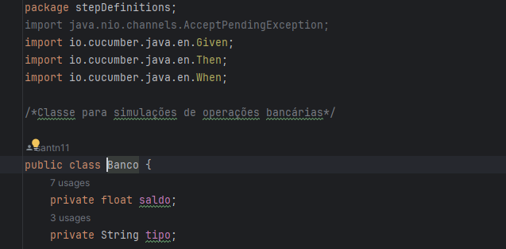
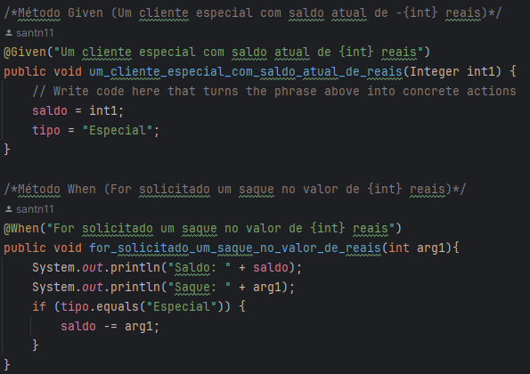
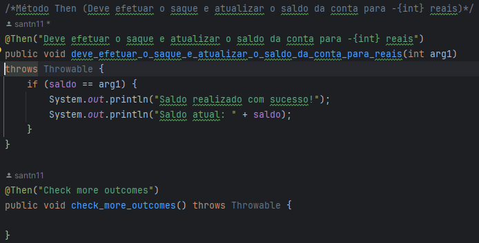
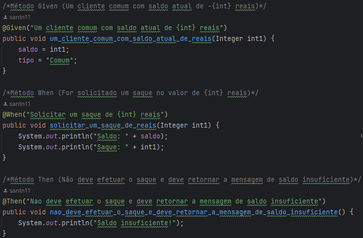
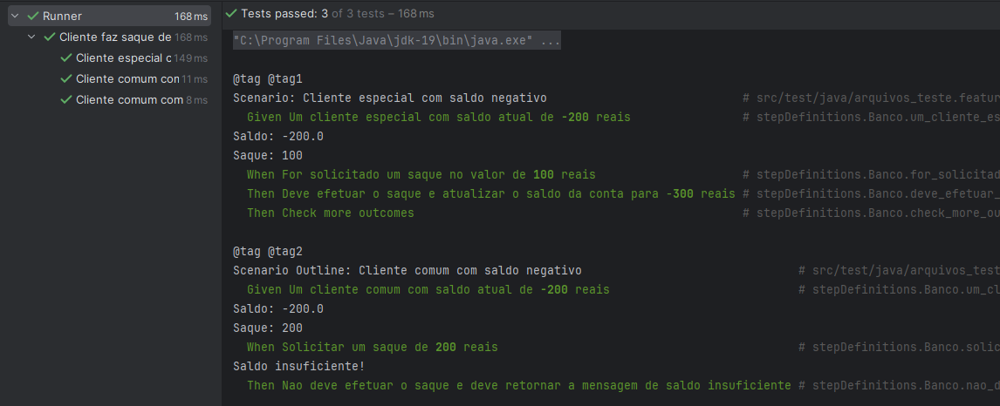
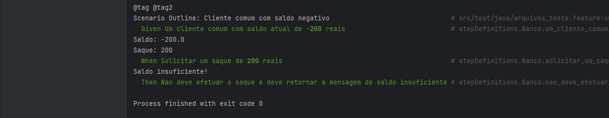

# Conta Bancaria com BDD e Cucumber

## Arquivo feature

## Classe com os métodos Cucumber

### Foram utilizados métodos para efetuar os testes de saque como:
 1. Given = Saldo
 2. When = Solicitação de saque
 3. Then = Resultado

### Métodos cliente especial

### Métodos cliente Comum

### Resultados:

